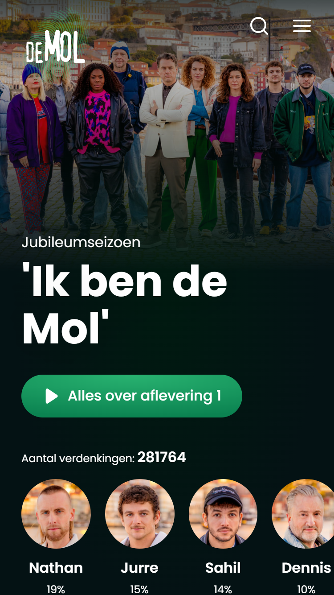
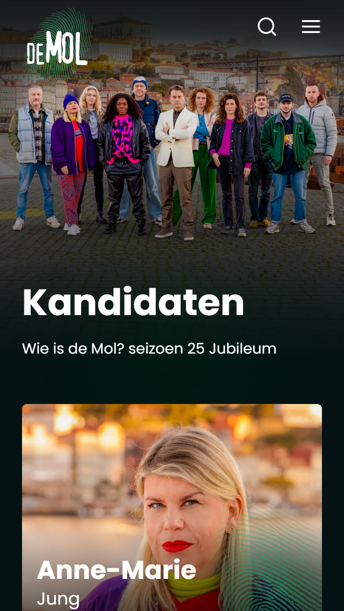
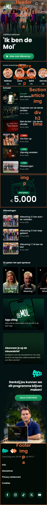
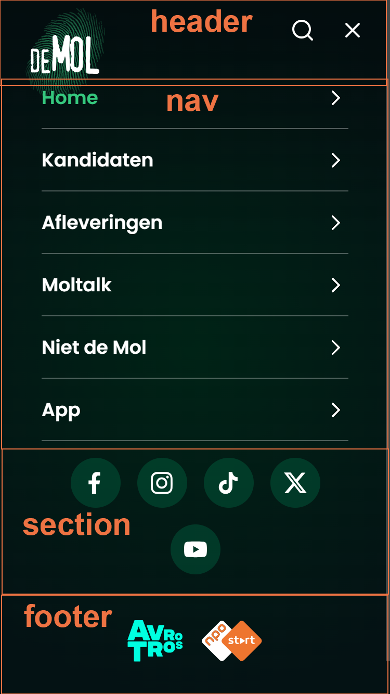
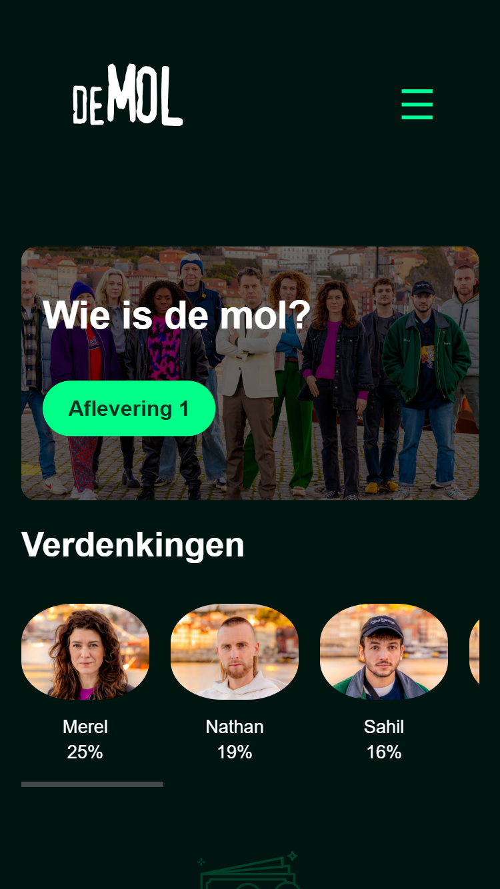
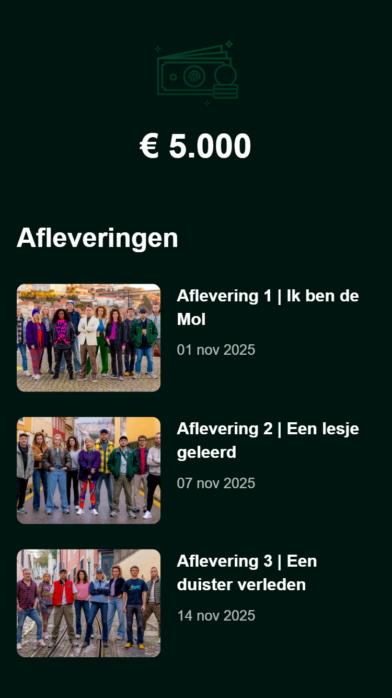
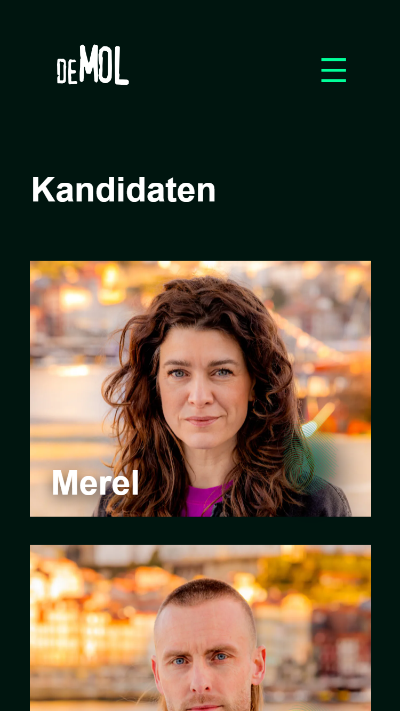

# Procesverslag
Markdown is een simpele manier om HTML te schrijven.  
Markdown cheat cheet: [Hulp bij het schrijven van Markdown](https://github.com/adam-p/markdown-here/wiki/Markdown-Cheatsheet).

Nb. De standaardstructuur en de spartaanse opmaak van de README.md zijn helemaal prima. Het gaat om de inhoud van je procesverslag. Besteedt de tijd voor pracht en praal aan je website.

Nb. Door *open* toe te voegen aan een *details* element kun je deze standaard open zetten. Fijn om dat steeds voor de relevante stuk(ken) te doen.

## Jij

  
uitwerken voor kick-off werkgroep

  ### Auteur:
  Julia Pauw

  #### Je startniveau:
  blauw/rood (kies uit zwart, rood óf blauw)

  #### Je focus:
  surface plane en klein beetje responsive (kies uit responsive óf surface plane)
 

## Je website

  
uitwerken voor kick-off werkgroep

  ### Je opdracht:
  link naar de website die je gaat namaken óf de naam/omschrijving van je eigen ontwerp
  https://wieisdemol.avrotros.nl/ 

  #### Screenshot(s) van de eerste pagina (small screen): 
  hier de naam van de pagina: home pagina  
  

  #### Screenshot(s) van de tweede pagina (small screen):
  hier de naam van de pagina: kandidaten pagina  
  
 

## Toegankelijkheidstest 1/2 (week 1)

  
uitwerken na test in 2e werkgroep

  ### Bevindingen
  Lijst met je bevindingen die in de test naar voren kwamen: De Wie-is-de-Mol-pagina’s scoren goed op structuur, semantiek en toetsenbordtoegankelijkheid, maar kunnen verbeteren op: Contrasten/kleurgebruik, ondertiteling/transcripten bij video’s, skip-link en meldingen bij nieuwe vensters, donker/licht-modusondersteuning.

## Breakdownschets (week 1)

  
uitwerken na afloop 3e werkgroep

  ### de hele pagina: 
  

  ### dynamisch deel (bijv menu): 
  

  ### wellicht nog een dynamisch deel (bijv filter): 
  

## Voortgang 1 (week 2)

  
uitwerken voor 1e voortgang

  ### Stand van zaken
  Eerste pagina daarvan de HTML opgeschreven. Geen problemen meegehad.

  ### Agenda voor meeting
  samen met je groepje opstellen

  Julia: Geen specifieke vragen, luisteren wat anderen voor vragen hadden.

  ### Verslag van meeting
  Bij de home-pagina is H1 het logo.

## Voortgang 2 (week 3)

  
uitwerken voor 2e voortgang

  ### Stand van zaken
  HTML van eerste en tweede pagina gemaakt. Klein beetje begonnen met de basis opbouw van de css. 

  ### Agenda voor meeting
  samen met je groepje opstellen

  Julia: Geen specifieke vragen, luisteren wat anderen voor vragen hadden.

  ### Verslag van meeting
  Echt beginnen met css maken voor de eerste pagina van je website.

## Toegankelijkheidstest 2/2 (week 4)

  
uitwerken na test in 9e werkgroep

  ### Bevindingen
  Lijst met je bevindingen die in de test naar voren kwamen (geef ook aan wat er verbeterd is):
  Fix als eerste: Alt-teksten toevoegen aan afbeeldingen, Skip-link toevoegen, Contrast optimaliseren op lichte gedeelten.
  Optioneel, maar sterk aanbevolen: prefers-reduced-motion ondersteunen, Dark/light mode aanbieden.

## Voortgang 3 (week 4)

  
uitwerken voor 3e voortgang

  ### Stand van zaken
  Css toegevoegd op de eerste pagina, nadenken wat ik op de tweede pagina extra wil toevoegen anders is het te weinig variatie tussen de pagina's.

  ### Agenda voor meeting
  samen met je groepje opstellen

  Julia: Geen specifieke vragen, luisteren wat anderen voor vragen hadden.

  ### Verslag van meeting
  hier na afloop snel de uitkomsten van de meeting vastleggen

  - Was maar 1 student assistent, dus de mensen die vragen hadden die lieten het zien op het grote bord. Waardoor je ook goed mee kon kijken naar de vragen en problemen die anderen hadden.

## Eindgesprek (week 5)

  
uitwerken voor eindgesprek

  ### Je uitkomst - karakteristiek screenshots:
  

  ### Dit ging goed/Heb ik geleerd: 
  Hamburger menu en interactieve elementen werkend gekregen, nth-of-type geleerd.

  

  ### Dit was lastig/Is niet gelukt:
  Dark/light mode nog niet volledig gemaakt.

  

## Bronnenlijst

  
continu bijhouden terwijl je werkt

  Nb. Wees specifiek ('css-tricks' als bron is bijv. niet specifiek genoeg). 
  Nb. ChatGpT en andere AI horen er ook bij.
  Nb. Vermeld de bronnen ook in je code.

  1. https://developer.mozilla.org/en-US/docs/Web/CSS/Reference/Properties/line-height
  2. https://developer.mozilla.org/en-US/docs/Web/CSS/Reference/Properties/flex-wrap
  3. https://developer.mozilla.org/en-US/docs/Web/CSS/Reference/Values/important 
  4. https://developer.mozilla.org/en-US/docs/Web/CSS/Reference/Properties/cursor 
  5. https://developer.mozilla.org/en-US/docs/Web/CSS/Reference/Properties/content 
  6. https://developer.mozilla.org/en-US/docs/Web/CSS/Reference/Selectors/::before
  7. https://developer.mozilla.org/en-US/docs/Web/CSS/Reference/Selectors/::after
  8. https://developer.mozilla.org/en-US/docs/Web/API/Window/requestAnimationFrame
  9. https://developer.mozilla.org/en-US/docs/Web/JavaScript/Reference/Global_Objects/Date/toLocaleString
  10. https://developer.mozilla.org/en-US/docs/Web/API/Node/parentElement
  11. https://developer.mozilla.org/en-US/docs/Web/API/Node/textContent
  12. https://developer.mozilla.org/en-US/docs/Web/JavaScript/Reference/Global_Objects/parseInt
  13. ChatGPT prompt: "Op de wie is de mol site heb je dat het getal bedrag veranderd van de huidige pot, wat kan je dan gebruiken in code. Zonder code voor mij te maken"
  14. School opdrachten via Code Pen

